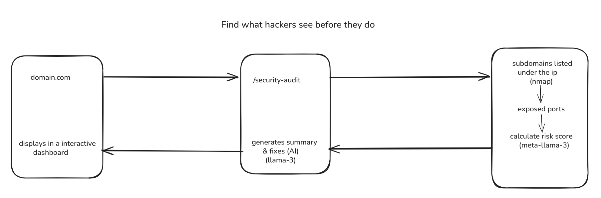

## 🛡️ SecureSight: AI-Powered Exposure Intelligence

SentinelScan is a proactive security engine that identifies subdomains, detects open ports, and utilizes local LLMs to provide real-time risk assessment and remediation strategies.

## 🔗 Quick Links
[Github Repository](https://github.com/saivivekanand27/aethronix)

[Website Live](https://aethronix-c19t.vercel.app/)

[API Live](https://aethronix.onrender.com/security-audit)

## ✨ Key Features
Automated Asset Discovery: Rapidly maps subdomains using HackerTarget and CRT.sh certificate logs.

Real-time Port Analysis: Deep-scan services and versions via Shodan API (or active Nmap scanning).

Local AI Analysis: Privacy-first intelligence using Ollama (Llama 3) to interpret raw technical data into human-readable risks.

Actionable Remediation: Generates specific CLI commands (Bash/Ansible) to close vulnerabilities instantly.

Demo Safety Mode: Built-in "Mock Mode" for stable presentations without API latency or rate-limit issues.

## 📝 Summary
Modern security teams struggle with "Shadow IT"—assets deployed and forgotten by developers. SentinelScan bridges the gap between raw data and actionable wisdom. By automating the discovery-to-remediation pipeline, it allows security teams to identify a critical exposure (like an unauthenticated MongoDB) and fix it in under 60 seconds.

## 🧠 Local AI Integration (Ollama + Llama 3)
Unlike traditional scanners that simply list ports, this project uses Ollama to host a local Llama 3 (8B) model for intelligent interpretation:

Privacy: No sensitive infrastructure data (IPs/Internal hostnames) ever leaves the local environment.

Contextual Scoring: The AI evaluates the "weight" of a vulnerability. An open port 80 on a dev box is "Low," but an open port 27017 on a high-RAM instance is flagged as "Critical."

Remediation Logic: Llama 3 parses the specific service version detected and generates the exact patch command required for that specific OS.

## 🌍 Real-World Use Cases
DevSecOps Automation: Run as a CI/CD gate to ensure no new staging servers are left with debug ports open.

Mergers & Acquisitions: Rapidly audit the external attack surface of a target company during due diligence.

Bug Bounty Hunting: Automate the reconnaissance phase to find low-hanging fruit like expired SSLs or forgotten subdomains.

## 🛠 Tech Stack
Backend: Node.js, Express.js, TypeScript

AI Engine: Ollama (Llama 3 8B)

APIs/Tools: Shodan API, HackerTarget, CRT.sh, Axios

Environment: DigitalOcean (Target VPS), Docker

## 📂 Project Folder Structure

Backend (server-side)

- /backend
	- src/
		- services/
			- scannerService.ts — Shodan & DNS logic; gathers subdomains, services, and port metadata
			- aiService.ts — Ollama / Llama 3 integration for inference and remediation suggestions
		- routes/
			- auditRoutes.ts — API endpoints (e.g., POST /security-audit)
		- middleware/
			- errorHandler.ts — centralized error handling and response formatting
		- index.ts — Express server entry point and app bootstrap
	- .env.example — environment variable templates (API keys, Ollama host, mock mode)
	- package.json — dependencies, scripts and project metadata
	- tsconfig.json — TypeScript configuration

Frontend (client)

- /frontend
	- src/ — React application (components, pages, router, services)
	- package.json — frontend dependencies and scripts
	- vite.config.ts — Vite build and dev configuration

This vertical layout clarifies where scanning, AI inference, routing, and middleware live so contributors can quickly find where to extend or troubleshoot functionality.

## 🏗 Architecture Workflow

The system follows a simple, linear workflow from user input to final report. Here's a human-friendly description of each step:

1) Submission — A user (or automated process) submits a domain to audit via the frontend UI or a POST request to the API. The request triggers the audit pipeline.

2) Reconnaissance — The backend's scanner service gathers external signals: subdomains (HackerTarget, CRT.sh), public service listings (Shodan), and optionally active scans (nmap). The goal is to enumerate hosts, open ports, and service fingerprints.

3) Aggregation & Normalization — Raw scan results are cleaned, deduplicated, and normalized into a compact audit object containing hosts, IPs, ports, services, SSL metadata, and timestamps.

4) AI Inference — A compact representation of the audit is sent to the local Ollama LLM with a focused "Security Analyst" prompt. The model returns structured JSON (risk score, short executive summary, and a small list of actionable fixes).

5) Reporting & Actions — The backend merges raw findings with the model's interpretation and returns a scannable report. The frontend renders dashboards, detail views, and remediation suggestions; reports can also be exported or used to trigger automation (e.g., CI gates, ticket creation, or remediation playbooks).

Notes:
- **Mock Mode:** Use `MOCK_MODE=true` during demos to avoid external API rate limits and ensure deterministic outputs.
- **Security:** Ensure the Ollama endpoint and scanning features are run in a trusted environment; do not expose scan controls publicly without authentication.

